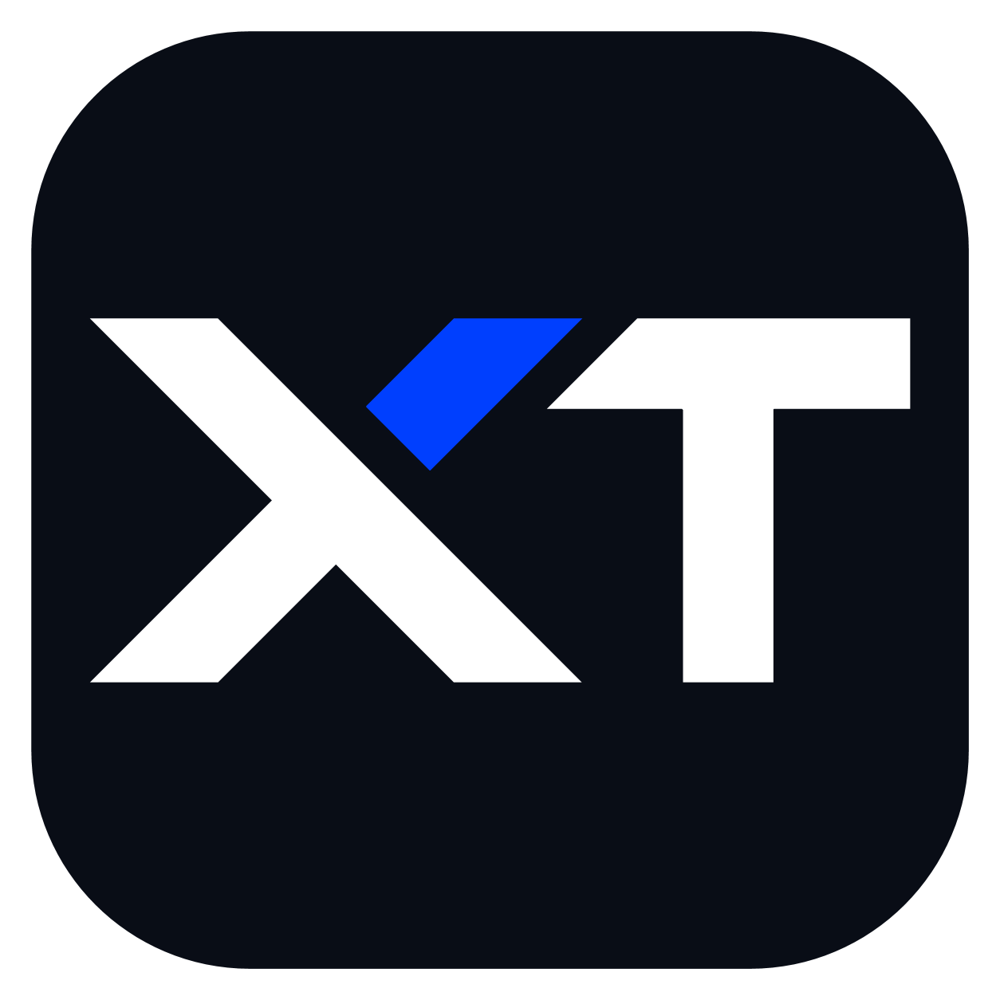

<p align="center">
  
</p>

<h1 align="center">XTLaw</h1>

<p align="center"><strong>想法即指令，执行交给我。</strong></p>

<p align="center">
  <a href="https://xtlaw.qayong.site/">官网</a> ·
  <a href="https://xtlaw.qayong.site/guide.html">使用指南</a> ·
  <a href="https://github.com/QAyong/XTLaw/releases">版本发布</a> ·
  <a href="https://github.com/QAyong/XTLaw/issues">问题反馈</a>
</p>

<p align="center">
  <a href="https://github.com/QAyong/XTLaw/actions/workflows/ci.yml"></a>
  <a href="./LICENSE"></a>
</p>

XTLaw 是基于 [Lexora](https://github.com/useLexora/Lexora) 二次开发的桌面 AI Agent，由 [QAyong](https://github.com/QAyong) 持续开发。它连接你选择的模型与工具，在授权范围内读取资料、编辑文件和执行任务，让对话与实际工作衔接起来。

**本项目是个人维护的二次开发版本。** 桌面运行时、任务系统、模型接入、工具与插件机制等基础能力来自 Lexora；XTLaw 在此基础上继续调整桌面工作流，并推进文档编辑、面板与聊天联动等能力。感谢上游作者和贡献者，项目保留原有贡献历史与 AGPL-3.0-only 许可。

## 文档与对话，同一个工作台

官网重点展示三个使用场景：

| 特性 | 能做什么 |
| --- | --- |
| 文档编辑 | 通过 Office DOCX 插件打开、编辑和保存文档，文档与聊天并排显示。 |
| 对话分支画布 | 查看问答之间的关联，从历史回答继续追问或重新生成，保留不同思路的上下文。 |
| 面板与聊天联动 | 查看材料时，将支持引用的选中内容加入聊天输入区，围绕当前材料继续提问，由你决定何时发送。 |

[](https://xtlaw.qayong.site/)

### 二次开发与当前状态

以上场景对应官网展示和当前本地开发版。**GitHub 默认分支尚未包含全部本地开发改动，当前也没有发布 XTLaw 安装包。** 尤其是 Office DOCX 插件及其预装、保存和选区引用改动，仍需与远端源码同步；不能仅凭官网截图判断当前克隆版本已经具备全部能力。

当前二次开发重点包括：

- **DOCX 文档工作流：** 在本地开发版中接入文档编辑、保存及选区引用，减少编辑器与聊天窗口之间的切换。
- **工作台布局：** 调整资源面板与聊天的左右位置、展开状态和会话切换体验。
- **对话与引用：** 继续完善对话分支、会话引用及执行过程展示。
- **XTLaw 品牌与官网：** 提供独立官网、使用说明、真实产品截图和捐赠入口。

Office 接入仍有边界：不承诺完整 Office 兼容或复杂文档格式保真；关闭文档前请确认已保存。开发版支持情况与未来发行版验收结果应分别核对。

## 基础能力

XTLaw 延续 Lexora 的桌面 Agent 基础：

- **执行与产物：** 读取资料、编写文件、运行工具，在工作台中查看执行过程与生成结果。
- **模型与工具：** 按需要连接模型服务，通过 Skills 和 MCP 扩展工作方法与工具。
- **文件与授权：** 选择工作目录，在授权范围内访问本地文件和工具。
- **自动化：** 安排定时任务；应用需在本机保持运行。
- **桌面体验：** 任务、资源面板与桌宠等桌面交互。

产品数据保存在本机。使用在线模型或外部工具时，相关内容可能发送给所选服务。处理重要文件前保留备份，并核对 AI 生成的事实与结果。

## 开始使用

1. 先阅读 [官网使用指南](https://xtlaw.qayong.site/guide.html)，了解模型配置与基本工作流。
2. 查看 [XTLaw Releases](https://github.com/QAyong/XTLaw/releases)。当前尚无公开安装包，后续以本仓库实际发布的版本为准。
3. 开发者可以按下方步骤运行源码；源码功能以所检出的提交为准。

上游构建配置涉及 Windows、Linux 和 macOS，实际安装条件、架构与平台支持以 XTLaw 后续发布包为准。

无需注册 XTLaw 账号，但需自行连接模型服务，按服务商要求配置 API Key 或账号授权。项目不提供内置免费模型额度，费用由所选服务决定。

## 官网

访问 **[xtlaw.qayong.site](https://xtlaw.qayong.site/)**，查看文档编辑、对话分支、面板联动的产品介绍与真实截图。

官网提供浅色 / 深色主题、手机适配、三项产品标签切换及常见问题说明。首屏截图支持滚动和悬停动画，小桌宠带表情互动；开启“减少动态效果”时会减少动画。右上角爱心按钮可打开支付宝捐赠二维码。

官网的演示图片与交互用于介绍产品，桌面端能力仍以实际源码和发布版本为准。

## 本地开发

需要 Node.js 26+、pnpm 12.5.1+ 和 Rust 工具链。平台依赖与打包方法见 [构建说明](packaging/buddy/README.md)。在仓库根目录运行：

```bash
pnpm --filter @uselexora/lexora --filter '@uselexora/lexora-buddy...' --filter @uselexora/lexora-website install --frozen-lockfile
pnpm dev

# 运行仓库内的网站开发服务
pnpm dev:website
```

仓库中的 `apps/website` 与当前独立部署的官网不是同一份站点实现；上述网站命令运行仓库内的网站源码。

项目的底层使用 Vue、Electron、TypeScript Runtime、Pi 与 Rust。部分包名和内部标识仍沿用 Lexora，属于二次开发的兼容保留。

## 反馈与贡献

XTLaw 的问题请提交到 [本仓库 Issues](https://github.com/QAyong/XTLaw/issues)，并说明版本、系统、复现步骤和期望结果。贡献方式见 [CONTRIBUTING.md](CONTRIBUTING.md)。

上游项目：[useLexora/Lexora](https://github.com/useLexora/Lexora)。如需了解上游能力与演进，可阅读其 [项目介绍](https://github.com/useLexora/Lexora#readme)。

## 许可证与致谢

本项目沿用 [AGPL-3.0-only](LICENSE)。感谢 Lexora 作者与所有上游贡献者；第三方组件的来源与许可按各自声明保留。

友情链接：[LINUX DO](https://linux.do/)
