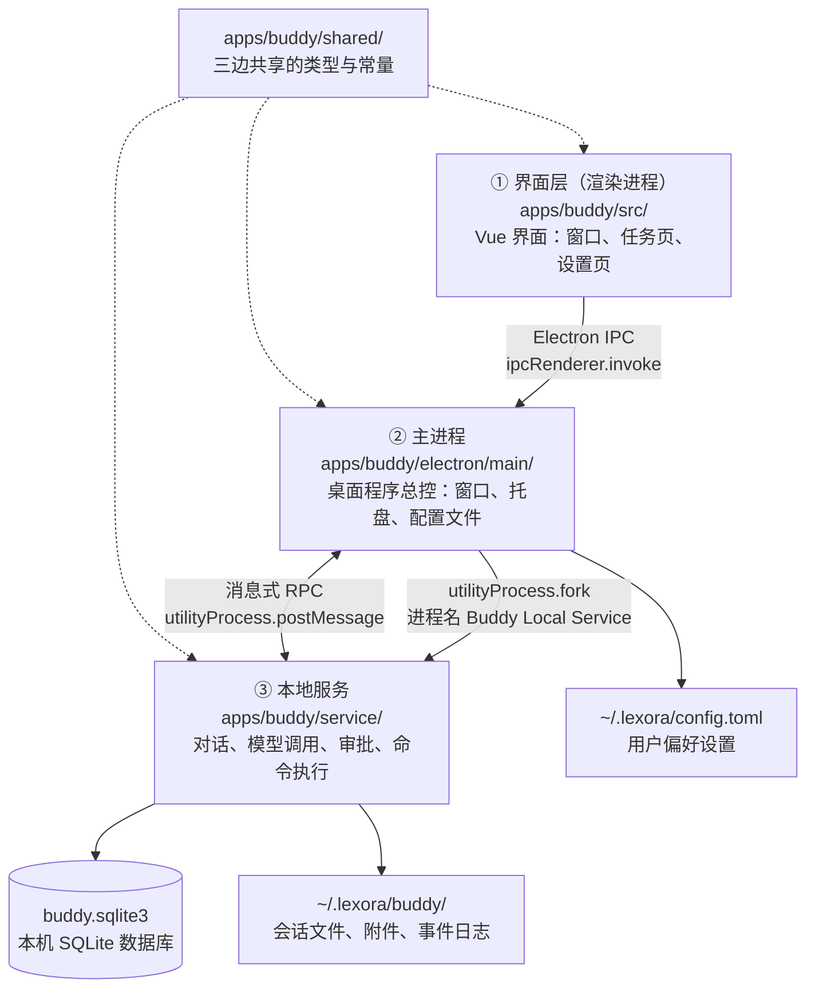
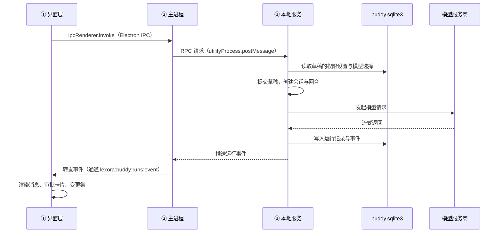
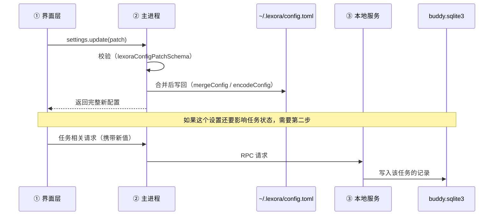

# 架构概览

**最后更新：** 2026-10-02

**适用范围：** `apps/buddy/`（Lexora Buddy 桌面应用）

**查看图形：** 本文的 Mermaid 代码块在 Codex / Cursor 对话里可直接渲染；用 VS Code 打开本文件后按 `Ctrl+Shift+V` 预览也可以看图。

---

## 1. 一句话

Lexora Buddy 是**纯本地桌面软件，没有远程服务器**。它由三个进程组成，全部跑在用户自己的电脑上；数据存在两个地方 —— 一个配置文件和一个 SQLite 数据库。

除了调用模型服务商那一步，其他功能断网也能用。

## 2. 三个进程

| 层 | 目录 | 干什么 | 关键入口 |
|---|---|---|---|
| ① 界面层 | `apps/buddy/src/` | 画界面。用户点下拉框、点开关，都是这一层在响应 | `src/main.ts`、`src/modules/` |
| ② 主进程 | `apps/buddy/electron/main/` | 桌面程序的"总控"。管窗口、托盘、开机启动，读写 `config.toml`，并监管本地服务的启动与重启 | `electron/main/app/DesktopApplication.ts`、`electron/main/runtime/BuddyServiceSupervisor.ts` |
| ③ 本地服务 | `apps/buddy/service/` | 干重活。存对话、调模型、跑命令、审批操作，读写 `buddy.sqlite3` | `service/src/index.ts`、`service/src/BuddyService.ts` |

**为什么界面层不直接读写数据库：** 界面层只能通过"预加载脚本"（`apps/buddy/electron/preload/`）暴露出来的受限接口发请求，由主进程转给本地服务。这样界面层拿不到文件系统和数据库的任意访问权。

## 3. 数据存在哪里（最关键的一节）

| 位置 | 存什么 | 归谁管 | 代码入口 |
|---|---|---|---|
| `~/.lexora/config.toml` | 用户偏好：语言、主题、窗口行为、聊天偏好、快捷键 | 主进程 | `electron/main/config/LexoraConfigStore.ts` |
| `~/.lexora/buddy/buddy.sqlite3` | 对话、草稿、任务、运行记录、用量 | 本地服务 | `service/src/storage/database.ts` |
| `~/.lexora/buddy/conversations/`、`spaces/`、`drafts/` | 会话文件、附件、事件日志（`.jsonl`） | 本地服务 | `service/src/storage/BuddyDataPaths.ts` |

数据根目录由 `electron/main/paths.ts` 决定：正式版是 `~/.lexora`，开发版是 `~/.lexora-dev`。

### 为什么这件事很重要

**一个"设置"经常横跨两边。** 举例：开关本身是"偏好"（存在 `config.toml`），但它要影响的对象 —— 每个任务的权限模式 —— 是 `buddy.sqlite3` 里的一条条草稿记录。

而且这两个文件归**两个不同的进程**管。所以一个设置值要"过几道门"才能生效：

1. 界面层把新值通过 IPC 发给主进程；
2. 主进程校验后写进 `config.toml`；
3. 如果这个设置还要影响任务状态，值必须再往下传到本地服务，由本地服务写进数据库。

漏掉第 3 步，就会出现"设置改了但完全没生效，而且不报错"。具体案例见 `docs/specs/feature-005-default-permission-mode.md`。

## 4. 核心业务流程

### 4.1 发送一条消息

界面层收到的是"推送"而不是"轮询"：主进程用 `send()` 把运行事件发给窗口（`electron/main/local-chat/notifications.ts`），预加载脚本把它包装成订阅接口（`electron/preload/local-chat/conversation.ts`）。历史事件另有一条拉取通道 `runs.listEvents`。

### 4.2 修改一个设置

### 4.3 工作台文字选区引用（第一批）

文件编辑器、只读源码和 Markdown 预览分别采集选区，统一交给工作台引用服务；不是把文件伪装成一条聊天消息，也不是广播给所有对话。

| 文件或标识 | 中文含义 | 职责 |
|---|---|---|
| `src/shared/ui/selection/workbenchSelectionReferences.ts` | 工作台公共引用服务 | 捕获来源与目标、去重、写入前重验、追加最新草稿 |
| `src/app/workbench/createDesktopSelectionReferences.ts` | 桌面目标适配器 | 根据真实分屏、资源标签页关联和可写状态确定候选，不用最近焦点猜目标 |
| `resourceQuotes` | 用户内容里的资源引用字段 | 保存冻结片段、文件来源与可用位置；与原聊天引用 `quotes` 并存 |
| `src/shared/ui/selection/ResourceSelectionQuoteMenu.vue` | 资源选区组件菜单 | 使用现有 NDropdown（下拉菜单组件）承载适用的编辑操作和引用目标，限制主菜单与子菜单宽度 |
| `lexora:selection-reference:edit` | 受限选区编辑通道 | 仅允许可信主渲染器主框架调用固定编辑命令，不接受任意脚本或角色 |

引用写入只改变指定草稿的引用区域，不自动发送、不新建任务、不切换分屏或抢输入框焦点。菜单编辑操作先恢复来源选区；Monaco（源码编辑器）的撤销、重做和全选在原编辑器执行，复制等操作沿用宿主编辑命令。

目标身份包含草稿、编辑器、对话目标和导航世代；切走后返回同一草稿也不能接受旧操作。模型接收的是标为不可信上下文的冻结片段，不重新读取原文件，也不增加文件访问授权。

当前只完成文件/Markdown 第一批接入。浏览器按钮式元素拾取、网页桥接和隔离插件接口仍待实现；完整设计及验证边界见 [Spec-013：工作台选区引用与多分屏目标](../specs/feature-013-workbench-selection-reference.md)。

## 5. 目录职责

| 目录 | 职责 |
|---|---|
| `apps/buddy/src/` | 界面层。Vue 组件、路由、设置页、任务页 |
| `apps/buddy/src/modules/` | 界面层的功能模块：`tasks/`（对话与任务）、`settings/`（设置页）、`prompt-input/`（输入框）、`automations/`（定时任务）等 |
| `apps/buddy/electron/main/` | 主进程。窗口、托盘、IPC 注册、配置文件读写、本地服务监管 |
| `apps/buddy/electron/preload/` | 预加载脚本。把受限的接口暴露给界面层 |
| `apps/buddy/electron/shared/` | 主进程与界面层共享的 IPC 契约：通道名、类型、校验规则 |
| `apps/buddy/service/` | 本地服务。对话、模型、审批、命令、存储、技能、插件 |
| `apps/buddy/shared/` | 三个进程共享的纯类型与常量（不含副作用代码） |
| `apps/buddy/platform/` | 平台适配层。把各操作系统的差异封装起来 |
| `apps/buddy/native/` | 原生代码（Rust）。桌宠等需要原生进程的能力 |
| `packages/` | 仓库内共享包 |

### 5.1 工作台插件与 Agent 内部扩展

用户界面统一使用“插件”：它是可安装、启用、禁用、更新和卸载的功能包。内部代码使用 `Extension`（工作台扩展）作为这套机制的技术名称，不代表另一类可安装产品。`apps/buddy/platform/extensions/ExtensionService.ts`（插件运行管理服务）管理其生命周期，`apps/buddy/electron/main/extensions/SandboxedExtensionHost.ts`（隔离插件宿主）负责隔离执行。

插件可以提供插件视图、命令、AI 工具和任务动作等。资源面板只是插件视图的一种展示容器，插件本身不属于资源面板；关闭标签页不等于禁用整个插件。

`apps/buddy/service/src/agent/extensions/BuddyInProcessExtension.ts`（Agent 进程内扩展类型）则用于应用向底层 AI 运行时注入工具、策略和事件处理逻辑。`apps/buddy/service/src/agent/resources/createBuddyResourceLoader.ts`（Agent 资源加载器）关闭自动发现外部扩展，使用应用注入的内部扩展。用户安装的插件通过宿主受限接口贡献 AI 能力，不直接成为进程内扩展。

术语规则与验收范围见 [Spec-012：插件术语统一](../specs/feature-012-plugin-terminology.md)。现有协议、清单文件名和安装包后缀保持不变。

## 6. 外部依赖

| 依赖 | 用途 | 接入层 |
|---|---|---|
| 模型服务商 API | 对话推理 | 本地服务 `service/src/providers/` |
| `@earendil-works/pi-coding-agent` | 编码代理运行时 | 本地服务 `service/src/agent/` |
| MCP 连接器 | 外部工具接入 | 本地服务 `service/src/connectors/` |
| 本机 SQLite（Node 内置 `node:sqlite`） | 数据持久化 | 本地服务 `service/src/storage/` |

## 7. 不变量（当前代码中已固化的约束）

以下约束来自代码本身，改动时必须保持：

- **权限不能向上越级。** 子运行、子会话的权限不得超过所属会话的权限上限，由 `isExecutionProfileWithin()` 限制。见 `service/src/storage/turnRequestRepository.ts`、`service/src/chat/ChatTurnService.ts`、`service/src/agent/sessions/BuddySessionFactory.ts`。
- **桌面窗口 IPC 校验发送方窗口和主框架。** `electron/main/ipc.ts` 使用 `assertTrustedSender()` 或 `requireTrustedWindow()` 校验；选区编辑入口另通过固定命令枚举与严格结构校验，不接受任意脚本或角色。
- **新任务的出厂默认权限是"智能审批"。** 由 `BUDDY_DEFAULT_APPROVAL_POLICY = 'policy'` 和 `BUDDY_DEFAULT_EXECUTION_PROFILE = 'workspace_write'` 决定，经 `resolveBuddyPermissionMode()` 解析为 `policy_approval`。见 `apps/buddy/shared/permissions/permissionMode.ts`。
- **配置文件权限为 `0o600`。** 只有当前用户可以读写 `config.toml`。见 `electron/main/config/LexoraConfigStore.ts`。

> 说明：本仓库当前**没有** `docs/adr/` 目录，因此以上不变量直接引用代码位置，而不是引用 ADR 编号。

## 8. 相关文档

| 类型 | 路径 | 说明 |
|---|---|---|
| 功能规格 | `docs/specs/` | 个人功能规格、方案与决定记录 |
| 架构概览 | `docs/architecture/overview.md` | 本文件 |
