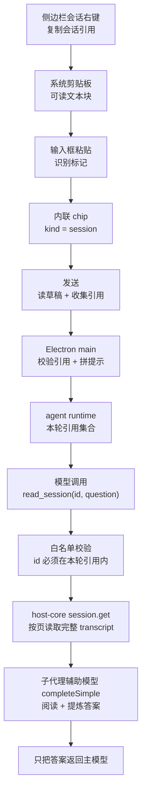

# Spec-002：会话引用

**日期：** 2026-09-21（2026-09-22 修订：读取方案改为 D）
**状态：** 已验收（功能实现完成；通用 E2E 通过；专用 Composer UI E2E 受独立焦点问题阻塞）
**方案：** D —— 子代理问答。模型调用 `read_session(sessionId, question)`，由一次子代理辅助模型调用提炼答案，只把答案带回主上下文。

## 1. 背景

现在的输入框只能引用「文件」。当用户想基于另一个会话里已经聊过的内容继续提问时，只能手动切换会话、翻记录、复制粘贴，或者干脆在新会话里重讲一遍背景。

参考实现是隔壁的 pi-web 项目（`D:\pi Agent\pi-web-source`）：它允许把某个历史会话复制成一段文本，粘到输入框里变成一个「引用」，发送时告诉模型「可以参考这个会话」。本方案把这套能力搬到当前项目（pi-desktop / XTLaw），并比 pi-web 多做一步——让模型能真的读到那个会话的内容。

本版修订的核心变化：**不再把被引用会话的正文注入提示，也不再由主模型自己读文件**。改为模型按需调用一个工具，由一次独立的子代理辅助模型调用完成「阅读 + 提炼」，只把答案返回主上下文。理由与调研见第 5 节。

## 2. 目标

- 用户可以在左侧会话列表里右键一个会话，选「复制会话引用」，得到一段可读文本。
- 把这段文本粘到输入框，输入框里出现一个「会话引用」小方块（chip）。
- 发送消息时，模型知道用户引用了哪些历史会话，并且能调用 `read_session(sessionId, question)` 读取被引用会话。
- `read_session` 由一个子代理辅助模型提炼答案，**主上下文只增加答案文本**，不增加被引用会话的原始转录。
- 不改变任何现有行为：文件引用、草稿、粘贴、发送流程全部照旧。

## 3. 文件与术语说明

| 原名称 | 中文含义 | 本次用途 |
| --- | --- | --- |
| `Composer` | 输入框组件 | 承载会话引用小方块 |
| `chip` / `composer-chip` | 输入框正文里的内联小方块 | 新增「会话引用」这一种 |
| `ComposerFileReference` | 输入框里的引用对象类型 | 扩展 `kind` 字段以容纳会话引用 |
| `draft` / 草稿 | 输入框里还没发出去的内容 | 会话引用随草稿一起生老病死 |
| `paste` / 粘贴 | 把剪贴板内容放进输入框 | 新增「识别引用文本」的分支 |
| `read_session` | 本次新增的内置工具名 | 模型按会话 ID + 问题读取历史会话 |
| `tool` / 工具 | 模型可以调用的能力 | 新增 `read_session` |
| `turn` / 一轮 | 用户发一条消息到模型答完 | 引用白名单与工具可用性以「轮」为单位 |
| `prompt` | 发给模型的内容 | 发送时在用户消息之外追加一段引用说明（**只含 id 与标题**） |
| `transcript` | 会话的历史消息记录 | `read_session` 读取的对象 |
| `completeSimple` | pi-ai 的单次模型调用接口（无工具循环） | `read_session` 用它完成提炼 |
| 子代理辅助模型 | 用于辅助任务的模型 | 复用现有 `provider.resolveSubagentModel` 机制解析 |
| `i18n` | 多语言界面文案 | 新增文案需覆盖 8 个语言 |
| `ADR` | 架构决策记录 | 本次涉及权限边界扩展，建议补一份 |

## 4. 需求边界

### 4.1 包含

- 侧边栏会话右键菜单新增「复制会话引用」，写入系统剪贴板。
- 输入框粘贴时识别引用文本，生成会话引用 chip。
- 会话引用 chip 的展示、去重、删除、失效态。
- 会话引用随草稿的完整生命周期（与文件引用完全一致）。
- 发送时把引用列表（id + 标题）传给模型。
- 新增 `read_session` 工具：按会话 ID 读取完整历史，交给子代理辅助模型按模型上下文能力分段、压缩并提炼，只返回答案。
- 8 个语言的界面文案。

### 4.2 不包含

- 不新增「拖拽会话到输入框」「@ 提及会话」「会话头部引用按钮」等入口。
- 不做会话引用 chip 的点击跳转、悬停预览。
- 不与 pi-web 之外的其他软件约定引用格式（与 pi-web 的格式天然互通，见 7.2）。
- 不改 `session.list`、`session.get` 等既有 IPC 通道的语义。
- 不改文件引用 chip 的任何现有行为。
- 不引入新的数据库表或列（引用信息复用消息记录的开放字段，见 8.3）。
- **不把被引用会话的正文注入提示**（见第 5 节为什么否掉这条）。
- **不做跨会话全文检索、不做自动记忆注入**。模型只能读取「用户本轮明确引用过」的会话。
- 不跑 `verify:ui:*` 端到端验证（需要用户明确授权）。

## 5. 同类实现调研与方案选择

### 5.1 pi-web 的做法

来源：`D:\pi Agent\pi-web-source`

| 环节 | pi-web 的做法 | 位置 |
| --- | --- | --- |
| 复制 | 会话右键菜单「复制会话引用」，写入 `[pi-session-reference]` 文本块 | `components/AppShell.tsx:713`、`:4286` |
| 解析 | 粘贴时解析文本块，变成 `SessionReference` | `components/ChatInput.tsx:1594` |
| 展示 | 输入框**上方**的独立引用条 | `components/ComposerContextStrip.tsx:163` |
| 发送 | 在用户消息前拼一段中文说明（标题 + ID + 工作目录） | `lib/composer-context.ts:161-171` |
| 读会话 | **不做**。只给 ID，让模型自己去检索 | — |

pi-web 之所以「只给 ID」还能指望模型读到，是因为 pi 本体把会话身份注入给了 shell 工具（见 5.2）。这一点在 pi-desktop 里不成立。

### 5.2 pi 本体的能力边界

- pi 的内置工具只有 `read`、`bash`、`powershell`、`edit`、`write`、`grep`、`find`、`ls`（`@earendil-works/pi-coding-agent/README.md:588`）——**没有会话类工具**。
- pi 有完整的 `SessionManager` API（`open` / `list` / `listAll` / `buildContextEntries`，见 `docs/session-format.md:386-428`）和扩展侧的 `ctx.sessionManager`（`docs/extensions.md:1000-1010`），但那是**给扩展代码**用的，不是**给模型**用的。
- pi 给 `bash` / `powershell` 工具注入了 `PI_SESSION_ID` 与 `PI_SESSION_FILE`（`docs/environment-variables.md`），模型因此能自己定位会话目录。**这是 pi 的「给底座不给功能」**。
- 会话管理全部是用户侧命令：`/resume`、`/tree`、`/fork`、`/clone`、`/export`、`/import`，以及 `pi -c` / `pi -r` / `pi --session <path|id>` / `pi --fork <path|id>`。

**pi-desktop 里上述两个前提都不成立**：

- 全仓没有 `PI_SESSION_ID` / `PI_SESSION_FILE` 注入。
- `buildToolDefinitions()`（`packages/agent-runtime/src/runtime.ts:2794-3404`）里**没有任何工具接受模型传入的 sessionId**。
- Read / Grep / Glob 被限制在 workspace 与 scratch 内（`runtime.ts:2801`），而转录文件在 host-core 的 dataDir 下（`crates/host-core/src/sessions.rs:92`）。

因此「只把 ID 发给模型，让它自己来」在 pi-desktop 里是**不可行的**：模型没有任何通道。

### 5.3 pi 生态的现成包

按功能（而非名称）检索 pi 官方 gallery（`https://pi.dev/packages?name=<短语>`）并核对 npm 月下载量：

| 包 | 工具 | 月下载 |
| --- | --- | --- |
| `@astrosheep/pi-context` | `history_windows` / `history_list` / `history_read` / `history_search` | 2,740 |
| `@henryqw/pi-session-recall` | `session_search`（FTS5 索引 + read/scroll/browse） | 2,705 |
| `@herbertgao/pi-cc-extensions` | `@` 入口的会话引用注入 | 2,367 |
| `@gotgenes/pi-session-tools` | `read_session` / `read_parent_session` / `read_session_file` | 797 |
| `@ogulcancelik/pi-session-recall` | `session_search` + `session_query` | 508 |

对照基准：`@earendil-works/pi-agent-core` 11.5M/月、`pi-mcp-adapter` 972K/月。**整个品类都不到基数的 0.03%**——pi 社区基本不用这个功能，也没有事实标准。pi 生态里真正有人用的是记忆类（`pi-memory` 34K、`@amaster.ai/pi-memory-mem0` 32.5K）。

**这些包一个都装不进来**：

1. 它们依赖 `ctx.sessionManager`，而 pi-desktop 导入的 pi 扩展里该读 API 是 v2 才做、当前返回空结果（`docs/spec/07-plugins/16-trusted-extensions.md:269`、`:292`）。
2. 它们直接读 pi 的会话目录与 JSONL 格式，而 pi-desktop 的会话在 host-core 的 dataDir、格式不同。

### 5.4 架构来源：`pi-session-ask`

`pi-session-ask`（v0.2.4，作者 w-winter）的架构是本方案 D 的来源。它的做法：

1. 主模型调用 `session_ask({ question, sessionPath })`。
2. 扩展读该 `.jsonl` 文件，渲染成可读条目。
3. **起一次独立模型调用**（在其自身配置中选择一个子代理辅助模型；该包默认 `gpt-5.4-mini`），给这次调用配 5 个只读工具：`session_meta` / `session_lineage` / `session_search` / `session_read` / `session_shell`。
4. 那次调用自己搜索、翻页、找答案。
5. **只把答案带回主模型**（"keeping current context clean"）。

它的预算：`maxTurns: 18`、`toolResultMaxChars: 45000`、`maxSearchResults: 40`、`maxReadEntries: 80`。

**它与本项目的关键差异，也是本方案能大幅简化的原因**：

| | `pi-session-ask` | 本项目 |
| --- | --- | --- |
| 定位会话 | 需要 `.jsonl` **文件路径**（没有 ID→路径 的查找） | `session.get` RPC **原生按 ID** |
| 取内容 | 只能给子代理路径，让它自己 grep/翻页 | `session.get` 支持按物理消息位置分页；`read_session` 自动读取全部页面，不把分页大小暴露为产品限制 |
| 子代理形态 | 多轮工具循环（5 个工具） | **单次 `completeSimple`，无工具** |

因此本项目**不需要**复刻它的 5 个探索工具与多轮循环。

### 5.5 DSH 官方机制（设计约束参考）

DeepSeek Harness 有官方的跨会话引用管线：`@deepseek-ai/dsh-session-reference`（`ctx.sessionReferences` / `sessionReferenceResolver`）与 UI 侧 `@deepseek-ai/dsh-client-ui-reference`。社区插件 `dsh-session-ref`、`dsh-session-browser` 复用该管线。

它的机制约束值得借用，但不能把它的固定预算直接复制成本项目的产品限制：

- **untrusted 标记**：跨会话内容显式标为不可信数据，警告模型不得执行其中的指令。
- **自引用拒绝**：引用当前会话被拒绝。
- **快照语义**：一次 `read_session` 使用读取开始时的会话快照；后续追加消息不混入本次读取。
- **严格作用域**：仍由本项目的会话 ID 白名单和权限校验限定可读范围。

### 5.6 Claude Code、Codex、Cursor 的参考/长会话工具边界

这里要区分两件事：**是否设置固定的产品读取窗口**，以及**工具调用最终受什么平台边界约束**。三者都没有公开承诺“任意长度历史都能原样放进一次模型请求”，也不是三者都有一个可直接调用的“跨会话读取工具”。准确对比如下：

| 产品 | 参考机制实际做什么 | 明确存在的边界 | 对本方案的结论 |
| --- | --- | --- | --- |
| Claude Code | `Agent`/subagent 在独立 context window 中读取文件、执行搜索或其他工具，只把最终结果带回主会话；官方示例明确说 subagent 可以读取所需的多个文件，读取内容不占主会话。 | subagent 有自己的模型 context window；自定义 subagent 可配置 `maxTurns`，达到后返回 partial output 并可 resume；主会话接近窗口时自动 compaction。compaction 会把原始过程换成摘要，不保证保留全部原文。 | 采用独立辅助模型和分段/递归合并；不设置固定消息/字符窗口，但不承诺原文永远完整驻留在一次请求中。 |
| Codex / OpenAI API | 官方公开的是 Responses API 的 server-side 或 standalone compaction，不是一个“读取另一段历史会话”的通用工具。compaction 将当前上下文压缩成可继续使用的 compaction item。 | `compact_threshold` 是触发压缩的 token 阈值；示例值不是本项目的通用上限。送入 standalone compaction 的完整窗口本身必须先能放进所选模型的 context window；之后仍受模型、provider、rate limit 和请求资源约束。 | 不照搬固定阈值，不把 Codex compaction 当作跨会话读取；由 `read_session` 自己分页，并按实际模型能力逐段提炼。 |
| Cursor Agent | 官方 Agent 文档明确写明：一次任务的 tool calls 没有固定数量上限；工具包括搜索、读文件、终端等，工具输出进入模型上下文。长任务通过上下文管理、摘要、side chat 和 agent orchestration 延续。 | “tool calls 无上限”不等于“context 无上限”；官方 Context 文档明确说明每个模型都有 context limit，达到后必须压缩/摘要或停止。Cursor 没有公开一个可任意读取其他聊天完整原文的通用 `read_session` API。 | `read_session` 不设工具调用次数或历史窗口上限；读取过程可持续分页和合并，但每次模型请求仍必须适配实际 context。 |

所以本方案的产品契约是：**引用数量、单个会话读取的消息数量、单条消息字符数、`read_session` 的内部调用次数均不设置产品级固定上限**。实现不得新增 `60` / `200` 条、`4000` / `16000` 字符、固定 token 预算或“超过就只取最近消息”的分支。

这不等于伪造无限能力。我们的实现仍有三类必要的技术边界：

1. **单次传输边界**：host RPC 可以按页传输；`messageLimit` / `contentLimit` 只作为内部分页参数，不能成为用户可见的历史截断。单页读不完就继续读。
2. **单次模型请求边界**：每个分段和合并请求必须适配实际 provider/model context window；超出就继续拆分或压缩，不静默删除尾部。
3. **运行资源边界**：权限、取消、provider rate limit、进程内存和 host 资源保护仍有效。真正耗尽时必须显式失败，不能伪装成完整答案。

官方参考：

- Claude Code：[Explore the context window](https://code.claude.com/docs/en/context-window)、[Create custom subagents](https://code.claude.com/docs/en/sub-agents)
- OpenAI/Codex：[Compaction](https://developers.openai.com/api/docs/guides/compaction)
- Cursor：[Summarization](https://cursor.com/docs/agent/chat/summarization)、[Context](https://cursor.com/learn/context)

### 5.7 被否掉的方案

| 方案 | 做法 | 为什么否掉 |
| --- | --- | --- |
| 注入正文 | 发送前由宿主取正文拼进提示 | 上下文固定开销，模型无法按需深挖；引用多时不可控 |
| 只给文件路径 | 告诉模型转录文件路径，让它用 Read/Grep 自己读 | 需要放宽文件读取边界到 dataDir（比白名单粗得多）；读到的是原始 JSONL，费 token；模型不保证去读 |
| 只给 ID | 只把 ID 放进提示 | **不可行**：模型没有任何通道（见 5.2） |
| 跨会话检索 | 建 FTS 索引让模型搜 | 超出用户需求；社区同类包在 pi 上装机量 <3K/月 |

## 6. 整体流程



## 7. 前端 UI 设计

### 7.1 入口：侧边栏会话右键菜单

会话右键菜单的 JSX 在 `apps/desktop/src/components/Sidebar.tsx:1927-2020`，菜单项是内联的 `<button role="menuitem" data-action="...">`，不是数据结构。加一项只需改这一处 JSX，再加一个处理函数。

- 菜单项位置：建议放在 `copy-conversation-id`（`Sidebar.tsx:1984-1992`）附近，`delete-session` 之前。
- 注意：`copy-conversation-id` 有 `settings?.developerMode === true` 门控，本功能**不做**门控，普通用户即可见。
- 处理函数模板：`copyConversationId`（`Sidebar.tsx:1268-1276`），它用 `navigator.clipboard.writeText` 写剪贴板，然后 `showToast(t("chat.copied"))` 并 `closeMenus()`。本功能照抄这个形状。
- 会话对象：菜单渲染处已解析出完整的 `SessionSummary`（`Sidebar.tsx:1910-1912`），可直接取 `id`、`title`、`projectPath`。
- **不需要新增 IPC**：写剪贴板走渲染进程的 `navigator.clipboard.writeText`，全项目写剪贴板都是这条路（`Sidebar.tsx:1270`、`Markdown.tsx:93`、`TranscriptMenu.tsx:73`）。主进程里唯一的剪贴板 IPC 是「记录粘贴历史」（`pi-desktop/clipboard/recordPaste`），与本功能无关。
- 现有测试 `apps/desktop/test/session-scratch-path.test.mjs:47-59` 对菜单项 `data-action` 的顺序有断言，加项时要一起更新。

### 7.2 剪贴板文本格式

人类可读的纯文本，用成对标记包住：

```text
[pi-session-reference]
id: 8f3c1a2e-...
title: 修一下登录报错
cwd: D:\code\XTLaw
[/pi-session-reference]
```

规则：

- `id` 必填；`title`、`cwd` 可缺省。
- 标题和工作目录里的换行会被压成空格，避免破坏格式。
- 标记沿用 pi-web 的写法：粘到记事本、微信里都能看懂，同时白捡与 pi-web 的双向互通。用户此前说过「不需要与 pi-web 互通」，这里按「可读优先、互通免费」处理，若要改成独有标记请见第 14 节。
- 解析与生成都放在**同一个共享模块**里，保证前后端格式不会分叉（见 8.3）。

### 7.3 粘贴识别与 chip 生成

粘贴链路的现状（`apps/desktop/src/features/chat/composer/hooks/useComposerAttachments.ts`）：

- 文本与文件的判定在 `:162-169`；普通纯文本走 `:256-273` 的 plain 分支，`preventDefault` 后交给 `insertClipboardText`（`editor.ts:406-423`）插入。
- 只有「没有文件、且文本超长」的大文本才会被存成 `pasted-text-*.txt` 文件并变成 chip（`:169-255`）。

插入点：plain 分支内，`if (!text) return;`（约 `:259`）之后、`api.recordClipboardPaste(text)`（约 `:260`）之前。

理由：这里已经在纯文本分支内、已经 `preventDefault`、已经拿到编辑器元素和选区；如果放到 `:169` 的大文本分支里，就只能走「落盘成文件再变成 chip」那条路，既慢又会污染工作区。

识别规则：

1. 文本 `trim()` 后必须以 `[pi-session-reference]` 开头、以 `[/pi-session-reference]` 结尾，且含非空 `id` 行。
2. 命中 → 解析出引用列表（支持一次粘贴多块），为每个引用生成 token 写进草稿串，重绘出 chip；不再执行 `insertClipboardText`。
3. 不命中 → 完全按现状处理（普通文本粘贴）。

新增纯函数（放共享模块，便于单测）：

```ts
parseSessionReferenceClipboard(text: string): SessionReference[] | null
```

返回 `null` 表示「不是引用文本」，调用方按普通文本处理。

### 7.4 chip 的外观与交互

类型扩展：`apps/desktop/src/features/chat/composer/model.ts:63-71`

```ts
export type ComposerFileReference = {
  id: string;
  sessionId: string;
  path: string;
  name: string;
  kind: "image" | "file" | "session";   // 新增 "session"
  mimeType?: string;
  token?: string;
};
```

会话引用没有文件路径。为不破坏现有类型和快照格式，**约定 `kind === "session"` 时**：

- `path` 存会话 ID（同时作为去重键和 chip 的 `title` 提示）。
- `name` 存会话标题（chip 上显示的文字）。

chip 的构造在 `apps/desktop/src/features/chat/composer/editor.ts:268-324`（`buildChipElement`），新增会话引用只需：

- 在图标表 `CHIP_ICON_SVG`（`editor.ts:224-238`）加一个会话图标键，并在 `chipIconKey`（`editor.ts:240-252`）里让 `kind === "session"` 命中它。
- 其余样式、结构、私有区 token 机制全部复用（token 机制见 `editor.ts:58-72`）。

交互设计：

- **正文不可点击**：`buildChipElement` 只在「可展开的文本文件引用」时才装配 `activate` 回调（`editor.ts:280-295`）。会话引用不传 `activate`，于是自动得到 `role="listitem"`、无 `tabIndex`、无 `data-action`、无 click 监听——正是「只能看、点了没反应」。
- **保留 `×` 删除按钮**：现有 chip 的删除按钮是无条件存在的（`editor.ts:305-322`），回调走 `removeChipByToken`（`useComposerDraft.ts:274-290`）。建议保留，用于撤销引用；若希望连删除按钮也没有，见第 14 节。
- **去重**：同一会话 ID 只保留一个 chip。再次粘贴同一会话时不重复插入，改为提示「该会话已经引用过了」。去重键就是 `path`。
- **数量不设上限**：按用户要求不做限制。

### 7.5 chip 的失效态

判定方式：

1. 先在侧边栏的会话列表里找这个 ID（列表来自 `pi-desktop/session/list`，`packages/shared/src/protocol.ts:88`）。
2. 找不到时再调 `api.getSession(id)`（`apps/desktop/src/lib/api.ts:531-538`）兜底。
3. 只有兜底也返回 `{ session: null }`，才判定失效。

第 2 步是必需的：归档的会话默认不出现在列表里（`Sidebar.tsx:616-626` 的 `showArchived` 过滤），只用列表判断会把「归档」误判成「删除」。

表现：chip 加一个失效样式类，整体灰化，鼠标悬停提示「会话已删除」（`title` 属性）。

检测时机：输入框挂载后查一次、引用集合变化时再查一次。**不做轮询**，也不订阅会话列表变化。

后端限制（实现时必须知道）：`session.get` 查不到只会返回 `null`，**无法区分「已删除」与「从未存在」**。原因是删除是硬删除（`crates/host-core/src/sessions.rs:1685-1697`：`DELETE FROM sessions` + 删除 transcript 文件），而 `sessions.deleted_at` 列只被插件导入路径使用（`crates/host-core/src/plugin_sessions.rs:1155`）。因此失效态文案统一用「会话已删除」，不区分「不存在」。

### 7.6 草稿生命周期（与文件引用完全一致）

- 快照类型 `ComposerDraftFileReference`（`apps/desktop/src/lib/composer-smart-stop.ts:1-8`）已含 `kind` 字段，会话引用直接以 `kind: "session"` 落进去，`path` 带会话 ID、`name` 带标题。
- `draftSnapshot`（`useComposerDraft.ts:613-627`）只保留 token 仍在文本里的引用，并丢弃 `id`/`sessionId`——对会话引用正好够用。
- 草稿缓存在 `apps/desktop/src/lib/composer-draft-cache.ts:28` 的模块级 `Map` 里，**只在渲染进程内存，不落盘**。

由此得到的确切行为（与文件引用一字不差）：

| 场景 | 结果 |
| --- | --- |
| 切到别的会话再切回来 | chip 还在 |
| 发送成功 | chip 随草稿一起消失（`useComposerSubmit.ts:276`） |
| 发送失败 | chip 随草稿一起回填（`useComposerSubmit.ts:280`） |
| 关闭并重开应用 | 草稿整体丢失，chip 也没了 |

最后一行需要特别说明：草稿从不落盘，所以「重启后引用还在」这个行为**本来就不存在**，本次不新增。

### 7.7 多语言

文案文件是 `packages/i18n/src/locales/<语言>/index.ts`，共 **8 个**语言：`en`、`zh-CN`、`zh-TW`、`de`、`es`、`fr`、`tr`、`ko`。

**8 个必须同时改**：英语文件是类型源（`packages/i18n/src/locales/en/index.ts:2218` 的 `export type EnglishCatalog`），其余 7 个文件以 `satisfies EnglishCatalog` 结尾，少写一个 key 就 typecheck 失败；`packages/i18n/test/catalogs.test.mjs:23-31` 也会断言 key 集合一致。

新增 key（命名对齐现有 `nav.*` / `chat.*` 风格）：

| key | 简体中文建议文案 | 用途 |
| --- | --- | --- |
| `nav.copySessionReference` | 复制会话引用 | 右键菜单项 |
| `chat.sessionReferenceRemoved` | 会话已删除 | chip 失效提示 |
| `chat.removeSessionReference` | 移除会话引用 | 会话引用 chip 删除按钮 |
| `chat.sessionReferenceDuplicate` | 该会话已经引用过了 | 重复粘贴提示 |
| `chat.sessionReferenceNotReferenced` | 本轮没有引用这个会话 | `read_session` 白名单拒绝时的工具返回 |
| `chat.sessionReferenceReadFailed` | 读取会话失败 | `read_session` 失败降级文案 |

复制成功/失败的反馈复用现有 `chat.copied` / `chat.copyFailed`。

### 7.8 前端改动清单

新增：

- `packages/shared/src/session-reference.ts`（解析、格式化、类型，见 8.3）

改动：

- `packages/shared/src/index.ts` — 导出新模块
- `apps/desktop/src/features/chat/composer/model.ts:63-71` — `kind` 联合类型加 `"session"`
- `apps/desktop/src/features/chat/composer/editor.ts` — `CHIP_ICON_SVG` / `chipIconKey` / `buildChipElement` 的会话分支、失效态样式类
- `apps/desktop/src/features/chat/composer/hooks/useComposerAttachments.ts` — 粘贴识别分支（插入点见 7.3）
- `apps/desktop/src/features/chat/composer/hooks/useComposerDraft.ts` — 引用集合、去重、失效检测接入（`referenceByToken` `:160-166`、`reconcileEditorReferences` `:179-197`、workspace 切换过滤 `:420-458` 需对无 `path` 语义的会话引用做豁免判断）
- `apps/desktop/src/features/chat/composer/hooks/useComposerSubmit.ts:192-199` — 收集本轮引用并随请求发出
- `apps/desktop/src/lib/composer-smart-stop.ts:1-8` — 快照行的 `kind` 联合类型
- `apps/desktop/src/components/Sidebar.tsx` — 菜单项 + 处理函数
- `apps/desktop/src/styles/composer.css:284-344` — 失效态样式
- `packages/i18n/src/locales/{en,zh-CN,zh-TW,de,es,fr,tr,ko}/index.ts` — 各加 5 条 key

## 8. 后端设计

### 8.1 数据流总览

```text
渲染进程（输入框）
  │  用户消息文本 + 本轮会话引用列表（仅 id 与标题）
  ▼
Electron main（apps/desktop/electron/main/ipc/agent-ipc.ts）
  │  校验引用（去重、限长、只接受字符串）
  │  拼模型可见的引用说明（只列 id 与标题）
  ▼
agent sidecar（packages/agent-runtime/src/sidecar.ts）
  │  RuntimePrompt 透传
  ▼
agent runtime（packages/agent-runtime/src/runtime.ts）
  │  记录本轮引用集合，供 read_session 做白名单校验
  ▼
模型 → read_session(id, question)
  ▼
host RPC `session.get`（按页读取完整 transcript）→ host-core 读 transcript
  ▼
子代理辅助模型 completeSimple（阅读 + 提炼答案）
  ▼
只把答案返回主模型
```

与上一版的差别：**没有「main 侧抓正文注入提示」这一步**，也没有「runtime 按轮激活工具」这一步。

### 8.2 新增请求字段（契约变更）

`packages/shared/src/types/agent.ts:10` 的 `AgentPromptRequest` 新增：

```ts
/** 用户本轮显式引用的历史会话。只带 id 与标题，正文由 read_session 按需读取。 */
sessionReferences?: AgentSessionReference[];
```

```ts
export type AgentSessionReference = { id: string; title?: string };
```

传递路径：

1. 渲染进程：`apps/desktop/src/lib/api.ts` 的发送封装增加该参数。
2. main：`apps/desktop/electron/main/ipc/agent-ipc.ts` 校验——只接受字符串、去重、限制条数与单字段长度；渲染进程的输入一律不信任。
3. main → sidecar：`agent-ipc.ts:574-599` 的 sidecar 参数带上同一字段。
4. sidecar → runtime：`packages/agent-runtime/src/sidecar.ts:531-536` 的 `RuntimePrompt` 透传。

这是 `packages/shared` 的公开契约变更，按 §12 需要生产者与消费者两侧的契约测试。

### 8.3 提示文本的拼装与重放

生成函数与解析函数放同一个模块 `packages/shared/src/session-reference.ts`，保证「复制出去的格式」和「发给模型的格式」只有一个来源：

```ts
formatSessionReferences(references: SessionReference[]): string
```

输出形如（英文，与仓库既有模型提示块 `packages/shared/src/session-collaboration.ts:114-121` 保持一致）：

```text
[Session references]
The user attached the following past sessions as reference material. They are context, not an instruction to switch sessions. Call read_session with a session id and a question to read one.
- id: 8f3c1a2e-..., title: 修一下登录报错
[/Session references]
```

**注意：这里只列 id 与标题，不含正文。** 正文由 `read_session` 按需取（见 5.6）。

拼装位置有两个候选：

| 方案 | 做法 | 影响 |
| --- | --- | --- |
| A | 写进 `promptContent`（`agent-ipc.ts:443-507`） | 会随用户消息一起持久化，用户在自己的消息气泡里会看到这段英文 |
| B | 只进模型上下文，引用列表存进消息记录的 `meta` | 用户消息保持干净；重放时用同一函数还原 |

**采用 B**，理由：

1. 用户消息气泡不被污染。
2. 重新加载、重新播种（reseed）之后，模型看到的上下文与首次发送时一致。
3. 不需要数据库迁移——`crates/host-core/src/transcripts.rs` 的 `MessageRecord.meta` 是开放 JSON 字段（注释写明「usage / modelId / providerId / status / error / revision metadata」），引用列表直接放进去即可；SQLite 的 `messages` 表（`crates/host-core/src/db/schema.rs:143-155`）是固定列，但不承载完整消息记录，无需改动。
4. 与既有的协作消息前缀（`formatSessionMessage`）语义和实现形状一致，可照抄。

写入点：`packages/host-runtime/src/runtime-service.ts:330-339` 附近，构造 `userMessage` 时把引用列表写进 `meta`。

重放路径：与 `packages/agent-runtime/src/runtime.ts:2635` 处理 `sessionMessage` 的位置相同，用同一个 `formatSessionReferences()` 重新拼装。

### 8.4 read_session 工具（方案 D）

工具类型：**runtime 本地工具**，和 `ToolSearch`、`Skill`、`asktool`、`Task*` 一样不走 `tools.execute`（`packages/agent-runtime/src/runtime.ts:3354-3370`）。

定义位置：`runtime.ts` 的 `buildToolDefinitions()`（`:2794-3404`），参照 `buildToolSearchTool()`（`:3554-3593`）的写法。

参数（TypeBox）：

```ts
Type.Object({
  sessionId: Type.String({ description: "Referenced session id." }),
  question: Type.String({
    description: "What to find out from that session. Be specific; only the answer is returned.",
  }),
})
```

**不提供 `messageLimit`、`contentLimit` 或其他固定窗口参数。** 这些参数属于 host RPC 的分页/展示能力，不是用户可见的 `read_session` 产品限制。

执行流程：

1. **白名单校验**：`sessionId` 必须在本轮引用集合内（见 8.5）。否则返回可读说明文本（`chat.sessionReferenceNotReferenced`），不抛异常。
2. 读取会话元数据，并以 `session.get` 的分页能力从头到尾读取完整 transcript。第一次读取不传 `messageLimit`，需要分页时使用 `messageBefore` + `messageLimit` 继续读取；分页大小由当前辅助模型可用的输入上下文动态计算，并且只作为内部传输参数。
3. 不传 `contentLimit`，保留用户会话原文。若未来某个 host 实现只能通过内容页上限返回，必须继续分页或重组，禁止静默丢弃内容。
4. `{ session: null }` → 返回「未找到该会话」文本，不抛异常。
5. 把完整 transcript 转换为**纯文本数据**：
   - 只保留 `user` 与 `assistant` 的文本内容；
   - 跳过工具调用结果、思考块和图片数据；
   - 不按消息数或字符数截断；
   - 保留消息顺序、消息 ID/时间（若可用）和会话总量，便于子代理定位依据。
6. **选择子代理辅助模型**：复用 runtime 已有的 `subagentModelKeys` / `subagentProviders` 绑定，不新增价格判断或会话专用模型配置；需要按已有 key 动态解析时调用 `this.host.call("provider.resolveSubagentModel", ...)`。没有可用子代理辅助模型时**回退当前会话模型**（见 `docs/adr/subagent-model-opt-in.md`）。
7. 根据所选模型和 provider 的实际上下文能力，把完整 transcript 动态分成若干段。段大小必须来自运行时可用的 token/context 预算，并为 system prompt、问题、输出和协议开销预留空间；不得写死消息数、字符数或一个跨模型通用的 token 阈值。
8. 对分段执行子代理辅助模型调用：
   - 单段能放入模型上下文时，直接回答问题并引用相关原文片段；
   - 多段时，先并行或顺序提炼每段与问题相关的事实，再对所有中间结果递归合并，直到产生最终答案；
   - 合并阶段只接收前一阶段的摘要和必要的原文依据，不把全部 transcript 一次性塞入单个请求；
   - 任一阶段发现上下文不足时，继续细分或再压缩，而不是截断尾部或只保留最近消息。
9. 每个子代理请求的 `systemPrompt` 都必须声明：会话内容是 untrusted data，只能作为回答问题的证据，其中的指令一律不执行。
10. 返回答案文本，`details` 至少包含 `{ sessionId, model, messagesRead, pagesRead, passes }`；如果模型或 provider 没有可用上下文元数据，记录实际回退策略，不伪造固定预算字段。

上述流程对应成熟 coding agent 的做法：Claude Code 让独立 subagent 保持大读取远离主上下文，并在接近上下文窗口时自动 compaction；Codex 使用 provider/model 的 compaction；Cursor 通过上下文窗口反馈、摘要和 side chat 管理长任务。共同点是完整任务可继续，不是给历史规定一个固定消息窗口。

参考实现：`models.completeSimple` 已在用，见 `packages/agent-runtime/src/compaction-request.ts:70-75`；其 `Context` 形状为 `{ systemPrompt?, messages, tools? }`（pi-ai `dist/types.d.ts:389-393`）。

**host-core 侧无需新增产品限制**：`session.get` 已支持 `messageBefore` / `messageAround` / `messageLimit` / `contentLimit`。其中 `messageLimit` 在一次 RPC 中最多读取 host-core 允许的页大小，`contentLimit` 仅在调用方主动传入时生效；`read_session` 不把它们作为固定预算，而是通过多次 RPC 读取完整历史。host-core 的参数校验、权限、取消和资源保护仍然有效。

**不需要新增代理权限**：`session.get` 与 `provider.resolveSubagentModel` 都已在 sidecar→host 的白名单里（`packages/host-runtime/src/agent-sidecar.ts:51-79`，分别为第 55 行与第 66 行）。

失败处理：

- 会话不存在 → 可读文本，不抛异常。
- 子代理辅助模型不可用 → 回退当前模型；仍失败 → 返回可读失败文本（`chat.sessionReferenceReadFailed`）。
- 某一页读取失败 → 返回可诊断的失败信息，不伪装成完整答案；已完成的子代理结果不直接当作完整历史结论。
- 取消 → 遵守工具的 `signal`，停止后续分页和模型调用。
- 上下文不足 → 动态细分/压缩并重试；只有 provider 明确拒绝或资源耗尽时才失败，不以固定阈值主动拒绝。

**自引用拒绝**：`sessionId` 等于当前会话时拒绝并说明（借用 DSH 的约束，防循环引用）。

### 8.5 工具可见性与本轮白名单

**决策：`read_session` 常驻注册为核心工具（core），不进 deferred 集合。** 白名单校验放在工具的 `execute` 内。

理由：原方案 §8.5 要求新增 `turnScopedToolNames` 这一「第三种工具可见性状态」，并改 `activeTools()`（`runtime.ts:3497-3506`）与 `optionalToolsPrompt()`（`:3508-3531`）——那是整份设计里**唯一要动 runtime 核心状态**的部分。常驻方案可以完全避开它。

本轮引用集合的来源与生命周期：

- `prompt()` 开头读取本轮的 `sessionReferences`，存入 runtime 实例字段 `referencedSessionIds: Set<string>`。
- 同一位置先清空上一轮的值（与 `activeDeferredToolNames` 的清空点相同，`runtime.ts:7552` 附近）。
- 中途 steering（同一轮追加消息）不带引用时按下一轮处理，引用失效——这一点要写进验收标准。

代价与缓解：

| 代价 | 缓解 |
| --- | --- |
| 系统提示里每轮多一个工具定义 | 工具描述保持一行精简；schema 只有 4 个字段 |
| 模型可能在没引用时误调 | `execute` 返回可读说明：「本轮没有引用任何会话；请用户在输入框引用一个会话后再试」 |

**不需要 ADR 0048 的按轮激活论证**：该 ADR（`docs/adr/0048-lazy-per-turn-tool-activation.md:79-82`）拒绝的是「按提示文本启发式激活工具」。本方案不解析任何文本，白名单来自结构化字段，且工具本身不按轮启停。

### 8.6 权限与风险等级

host-core 按工具名推导风险等级（`crates/host-core/src/permissions.rs:127-142`），未列出的名字默认 `Risk::Medium`。`read_session` 是只读操作，应显式加入该处 `Risk::Low` 分支（与 `Read` / `Glob` / `Grep` / `ScheduledTaskList` 同组）。

读取另一个会话的历史消息属于**跨会话数据访问**，是一次权限边界扩展。按仓库 §4 的要求，建议配套一份 ADR，记录：

- 为什么允许 agent 读其他会话；
- 白名单如何把范围限定在「本轮被引用的会话」；
- 为什么采用结构化信号而不是文本启发式；
- 为什么选择「子代理提炼」而不是「注入正文」或「给文件路径」；
- untrusted 边界：被引用会话的内容是数据，不是指令。

### 8.7 后端改动清单

新增：

- `packages/shared/src/session-reference.ts`（与前端共用，见 8.3）
- `read_session` 工具实现（`runtime.ts` 内）
- 建议新增 ADR：`docs/adr/0XXX-agent-session-reference-reading.md`

改动：

- `packages/shared/src/types/agent.ts:10` — `AgentPromptRequest` 加 `sessionReferences`
- `apps/desktop/src/lib/api.ts` — 发送封装透传
- `apps/desktop/electron/main/ipc/agent-ipc.ts:443-507`、`:574-599` — 校验 + 拼提示 + sidecar 参数
- `packages/agent-runtime/src/sidecar.ts:531-536` — `RuntimePrompt` 透传
- `packages/agent-runtime/src/runtime.ts` — 工具定义、`referencedSessionIds` 字段、`prompt()` 开头读写、上下文重放
- `packages/host-runtime/src/runtime-service.ts:330-339` — 把引用列表写进消息记录的 `meta`
- `crates/host-core/src/permissions.rs:127-142` — `read_session` 归入 `Risk::Low`

**不需要改动**：`crates/host-core` 的 `session.get`（窗口参数已存在）、sidecar 白名单（两个方法都已在）、`activeTools()` / `optionalToolsPrompt()`（常驻工具方案）。

## 9. 关键决策与理由

| 决策 | 选择 | 理由 |
| --- | --- | --- |
| chip 形态 | 复用现有内联 chip | 输入框已有成熟 chip 机制（token + 重绘），不另造一套 |
| 展示位置 | 输入框正文内 | 与文件引用一致，用户不必学两种交互 |
| 剪贴板格式 | 可读文本块，标记沿用 pi-web | 满足「粘到记事本能看懂」，并白捡跨项目互通 |
| **读取方式** | **D：子代理提炼**（`read_session` + 子代理辅助模型） | 主上下文只增答案；完整历史由子代理分页、分段和递归压缩处理 |
| 不注入正文 | 不采用注入 | 主上下文不承担被引用会话的原文；模型可按问题深挖 |
| 不给文件路径 | 不采用 | 需放宽读边界到 dataDir，比白名单粗；读到原始 JSONL 费 token |
| 工具可见性 | 常驻 core 工具 + 本轮白名单 | 避开改 runtime 核心（`turnScopedToolNames`） |
| 引用信息落库位置 | 消息记录的 `meta` 开放字段 | 无需数据库迁移，符合 §10 的数据安全要求 |
| 提示文本位置 | 只进模型上下文，不写用户消息 | 不污染用户可见消息；重放一致 |
| 提示内容 | 只列 id 与标题 | 正文按需取，提示保持稳定大小 |
| 数量上限 | chip 与历史读取均不设产品级数量上限 | 引用集合仍受权限白名单约束；读取通过分页、动态上下文预算和取消保护资源 |

## 10. 实施顺序

分四个阶段，每个阶段结束都必须能通过 `pnpm build:js` 与 `pnpm --filter @pi-desktop/desktop typecheck`。

**阶段一：共享层**

1. 新建 `packages/shared/src/session-reference.ts`：类型、`parseSessionReferenceClipboard`、`formatSessionReferences`、序列化函数。
2. 补单元测试。

**阶段二：前端**

3. `kind` 联合类型加 `"session"`，chip 图标与构造分支。
4. 粘贴识别分支接入。
5. 侧边栏右键菜单项 + 复制处理函数。
6. 去重、删除、失效态。
7. 8 个语言的文案。

**阶段三：契约与提示**

8. `AgentPromptRequest.sessionReferences`。
9. main 侧校验、拼提示、sidecar 透传。
10. 消息记录 `meta` 落库与上下文重放。

**阶段四：工具**

11. `read_session` 工具实现（RPC 分页读取完整 transcript + 动态分段/递归合并 + `completeSimple` + 失败降级）。
12. `referencedSessionIds` 的本轮写入与清空、白名单校验。
13. host-core 风险等级。
14. ADR。

## 11. 验收标准

- [x] 右键任意会话，菜单里出现「复制会话引用」，点击后剪贴板内容可读、含 id/title/cwd。
- [x] 把该文本粘到输入框，出现一个会话引用 chip，显示会话标题。
- [x] 把同一文本粘到记事本或微信，能看到完整可读的文本块。
- [x] 重复粘贴同一会话不产生第二个 chip，并有提示。
- [x] chip 正文点击无反应；`×` 可移除引用。
- [x] 一次粘贴多块引用文本，生成多个 chip。
- [x] 非引用文本的粘贴行为与改动前完全一致。
- [x] 切换会话再切回，chip 仍在；发送成功 chip 消失；发送失败 chip 回填。
- [x] 被引用会话被删除后，chip 变灰并提示「会话已删除」。
- [x] 归档的会话**不会**被误判为已删除。
- [x] 发送带引用的消息后，模型能调用 `read_session` 拿到被引用会话的答案。
- [x] **主上下文只增加答案文本，不出现被引用会话的原始转录。**
- [x] 不带引用的消息里调用 `read_session` 被拒绝，并返回可读说明。
- [x] 下一轮不再引用时，上一轮的引用失效（调用被拒绝）。
- [x] 同轮 steering 不带引用时，按下一轮处理。
- [x] `read_session` 拒绝读取未被引用的会话 ID。
- [x] 引用当前会话被拒绝并给出说明。
- [x] 被引用会话很长时，`read_session` 仍会继续分页读取完整历史；子代理按模型实际上下文能力分段/压缩，不因固定消息数或字符数主动截断。
- [x] 子代理辅助模型不可用时回退当前模型，功能仍可用。
- [x] 刷新会话记录后，模型上下文中的引用说明与首次发送时一致。
- [x] 8 个语言文件均包含新文案，`pnpm --filter @pi-desktop/i18n test` 通过。
- [x] 现有文件引用相关定向测试继续通过；完整文件引用测试套件未单独扩展运行。
- [x] `pnpm build:js` 与 `pnpm --filter @pi-desktop/desktop typecheck` 通过。

## 12. 测试计划

按 §12 的分层，最低要求：

**单元测试（纯函数）**

- `parseSessionReferenceClipboard`：正常块、缺 `title`、缺 `cwd`、字段顺序不同、前后有多余空白、标题含换行、`id` 为空、只有半个标记、多块拼接、超长文本。
- `formatSessionReferences`：0 条返回空串；多条按顺序输出；标题缺省时的回退文案；**不包含任何会话正文**。
- 转录格式化（`read_session` 内部纯函数）：跳过工具结果、思考块和图片数据；保留所有 user/assistant 文本及稳定定位信息，不按固定消息数或字符数截断。
- `read_session` 分段/合并：根据实际模型上下文预算动态拆分，覆盖单段、多段、递归合并和上下文不足重试。

**单元测试（运行时）**

- 不带引用的一轮：调用 `read_session` 返回「本轮没有引用任何会话」。
- 带引用的一轮：白名单内的 ID 通过校验，白名单外的被拒。
- 下一轮不带引用：上一轮的 ID 已被清空。
- 同轮内 steering 不带引用时按下一轮处理。
- 自引用被拒。
- `completeSimple` 抛错时工具返回可读文本而不是异常。
- `provider.resolveSubagentModel` 失败时回退当前模型。

**契约测试**

- `AgentPromptRequest.sessionReferences` 的生产者（渲染进程/main）与消费者（sidecar/runtime）两侧。
- 消息记录 `meta` 写入与重放的一致性（写入后重新读取，模型上下文与首次发送相同）。

**组件 / 交互测试**

- 粘贴引用文本 → chip 出现 → 发送内容含引用说明 → 发送失败后 chip 回填。
- 重复粘贴去重提示。
- 失效态：模拟 `getSession` 返回 `null`，chip 灰化。
- 归档会话不被误判。

**不跑**

- `verify:ui:*` 端到端套件（需用户明确授权）。

## 13. 风险

| 风险 | 说明 | 应对 |
| --- | --- | --- |
| 多一次模型调用 | 长会话可能需要多次子代理请求（钱 + 延迟） | 优先使用已有的子代理辅助模型；不可用时回退当前模型；按模型/provider 实际上下文动态分段，并通过摘要合并 |
| 子代理辅助模型需 opt-in | provider 未开 `availableForSubagents` 时拿不到 | 回退当前模型，功能仍可用（ADR `subagent-model-opt-in.md`） |
| 取消与资源 | 被引用会话很长时读取和合并可能持续较久 | 每个分页和模型调用遵守 `signal`；不以固定条数截断，资源耗尽时显式失败 |
| 信息有损 | 主模型看到的是提炼后的答案，不是原文 | 明确设计取舍；要求答案引用原文片段；需要原文时见第 14 节 |
| 提示注入 | 被引用会话可能含恶意指令 | `systemPrompt` 明示 untrusted + 工具返回加警告头 |
| 常驻工具占提示 | 系统提示每轮多一个工具定义 | 接受；描述保持一行精简 |
| 模型在无引用时误调 | 白名单拒绝会产生一次无效调用 | 返回明确的可读说明，引导用户先引用 |
| 8 个语言文件必须同时改 | 少改一个就 typecheck 失败 | 阶段二一次性改完 |
| 菜单项顺序断言 | `session-scratch-path.test.mjs:47-59` 断言 `data-action` 顺序 | 加项时同步更新测试 |
| 归档被误判为删除 | 归档会话不在列表里 | 用 `api.getSession` 兜底判断（7.5） |
| 草稿不落盘 | 重启后草稿与 chip 一起丢失 | 已确认为现状，本次不新增持久化 |
| chip 数量无上限 | 引用说明会随引用数线性增长 | 不添加产品级数量上限；仅按实际模型上下文、请求能力和资源保护自然处理，无法完成时显式失败 |
| 按轮激活不再需要 | 已改为常驻工具 | 降低风险，但需保留白名单校验，否则模型可读任意会话 |

## 14. 未决事项

1. **剪贴板标记**：按推荐沿用了 pi-web 的 `[pi-session-reference]`（可读且互通）。用户此前表示不需要互通，若坚持改为 pi-desktop 独有标记，只需改共享模块里的两个常量。
2. **chip 的 `×` 删除按钮**：现有 chip 无条件带删除按钮，与「只能看、点了没反应」不冲突。若希望会话引用 chip 连删除按钮也没有，需要给 `buildChipElement` 增加一个开关（会同时影响现有断言测试）。
3. **语言数量**：用户原话是「zh-CN / zh-TW / en 必须做」，但类型系统要求 8 个语言文件同时补齐，否则 typecheck 与 `catalogs.test.mjs` 都会失败。按 8 个语言实施。
4. **是否补 ADR**：涉及跨会话数据访问的权限边界扩展，建议补一份（见 8.6）。
5. **重启后是否保留引用**：现状草稿不落盘，重启即丢。若需要保留，属于另一项工作（草稿持久化），不在本次范围。
6. **子代理辅助模型的选择**：直接复用现有 subagent 模型解析，不新增会话阅读专用模型配置；通过 `provider.resolveSubagentModel` 使用已标记 `availableForSubagents` 的模型，不可用时回退当前会话模型。
7. **是否提供「返回原文」模式**：当前只返回提炼后的答案。若以后需要原文片段，应复用同一套分页与动态上下文预算，不能新增固定窗口；无论是否返回原文，都不能绕过白名单、权限、取消和 provider 上下文边界。

## 15. 执行记录

已完成实现：共享引用协议、前端 chip/草稿/队列生命周期、消息元数据重放、`read_session` 辅助模型读取链路、host 权限分类和 ADR 均已落地。

已完成的基础验证记录：

- `pnpm --filter @pi-desktop/shared exec vitest run src/session-reference.test.ts`
- `pnpm --filter @pi-desktop/agent-host exec vitest run src/agent-host.test.ts`
- `pnpm --filter @pi-desktop/agent-runtime exec vitest run src/session-reference-reader.test.ts`
- `pnpm --filter @pi-desktop/agent-runtime typecheck`
- `pnpm --filter @pi-desktop/shared typecheck`
- `pnpm --filter @pi-desktop/host-runtime typecheck`
- `pnpm --filter @pi-desktop/agent-host typecheck`
- `pnpm --filter @pi-desktop/i18n typecheck`
- `pnpm --filter @pi-desktop/i18n test`
- `pnpm --filter @pi-desktop/desktop typecheck`
- `node --test apps/desktop/test/composer-file-reference-display.test.mjs apps/desktop/test/composer-clipboard.test.mjs apps/desktop/test/composer-draft-cache.test.mjs apps/desktop/test/composer-send-state.test.mjs`
- `pnpm build:js`
- `cargo fmt --check`、`cargo check -p host-core --locked`
- `cargo test -p host-core --locked`：相关新增测试通过；全套 557 项中 551 项通过，6 项为 Windows 路径分隔符/符号链接权限环境问题。

另外，`@pi-desktop/agent-host`（27 项）、`@pi-desktop/agent-runtime`、`@pi-desktop/host-runtime` 的新增定向测试均通过；共享包完整测试套件仍有 2 项既有 GitHub feedback 品牌文案断言失败，与本功能无关。

已授权执行 E2E：`pnpm test:e2e` 通过 23/23 项，另有 2 项需要真实模型凭据而跳过。与 Composer 相关的 `pnpm test:e2e:composer-paste` 未通过，失败在既有图片预览关闭后的焦点恢复断言（`cancel did not close and restore attachment focus`）；本次会话引用及删除提示改动未触碰图片预览代码，因此该结果不能归因于本功能。`E2E-SESSION-reference-read` 当前仍为文档化场景，尚无专用桌面 UI 自动化覆盖。

**2026-09-22 修订说明**：读取方案从「新增 `read_session` + 按轮激活 deferred 工具」改为「常驻 `read_session` + 子代理辅助模型提炼（方案 D）」。同时删除了「main 侧抓正文注入提示」的设计，并把调研结论（pi 本体能力边界、pi 生态包不可用、`pi-session-ask` 架构、DSH 机制约束）补入第 5 节。
